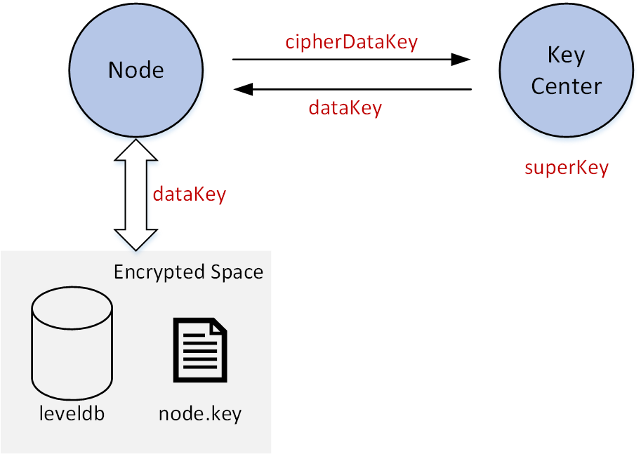

# Key Manager

Manage data encryption keys for FISCO BCOS nodes.
- **The version only supports** [FISCO BCOS 2.x](https://fisco-bcos-documentation.readthedocs.io/zh_CN/latest/docs/introduction.html).

## Description

In FISCO BCOS, each agency should run its own key manager service. The key manager is deployed in the internal network to manage its data encryption keys.

In [**disk encryption**](https://fisco-bcos-documentation.readthedocs.io/zh_CN/latest/docs/design/features/storage_security.html). The following figure shows how the key manager manages encryption data keys. 



Each node has their own ``` dataKey``` and use ``` dataKey``` to communicate with its encrypted space. A node does not manage its ``` dataKey```. It only has its ``` cipherDataKey```. ``` cipherDatakey``` is the ciphertext of ``` datakey ```encrypted by ``` superKey```.  When the node is booting, it sends ``` cipherDataKey``` to key manager, and key manager decrypts the ``` cipherDataKey```  using ``` superKey ``` and return ``` dataKey``` to the node. The node stores ``` dataKey``` in memory and drop it after the node is shut down.

## How to use

### Install dependency package

```shell
# In Centos
sudo yum install procps-ng-devel
sudo yum install curl-devel
# In ubuntu
sudo apt-get install libprocps-dev
# In ArchLinux
sudo pacman -S procps-ng
```

### Build

```shell
git clone https://github.com/FISCO-BCOS/key-manager.git
cd key-manager && mkdir build && cd build

# For Centos
cmake3 .. # Notice: There are ".." behind. 
# cmake3 .. -DBUILD_GM=On  #When building "guomi" key-manager

# For ubuntu
cmake .. # Notice: There are ".." behind. 
# cmake .. -DBUILD_GM=On  #When building "guomi" key-manager

make
#The execution: "key-manager" generated.
```

Note：Use ``` -DBUILD_GM=On ``` to build guomi Key Manager if needed.

### Start

``` shell
./key-manager 8150 123xyz # key-manager <port> <superkeyString>
```

### Check

Print info when successfully started.

```log
[1545471609499] [TRACE][Load]key-manager started,port=8150
```

### In disk encryption
Use key-manager in [disk encryption](https://fisco-bcos-documentation.readthedocs.io/zh_CN/latest/docs/manual/storage_security.html).


## Developing & Contributing
- Star our Github.
- Pull requests. See [CONTRIBUTING](CONTRIBUTING.md).
- [Ask questions](https://github.com/FISCO-BCOS/web3sdk/issues).
- Discuss in [WeChat group](https://github.com/FISCO-BCOS/FISCO-BCOS-DOC/blob/release-2.0/images/community/WeChatQR.jpg)  or [Gitter](https://gitter.im/fisco-bcos/Lobby).

## Community

By the end of 2018, Financial Blockchain Shenzhen Consortium (FISCO) has attracted and admitted more than 100 members from 6 sectors including banking, fund management, securities brokerage, insurance, regional equity exchanges, and financial information service companies. The first members include the following organizations: Beyondsoft, Huawei, Shenzhen Securities Communications, Digital China, Forms Syntron, Tencent, WeBank, Yuexiu FinTech.

- Join our WeChat [](https://github.com/FISCO-BCOS/FISCO-BCOS-DOC/blob/release-2.0/images/community/WeChatQR.jpg) and [](https://github.com/FISCO-BCOS/FISCO-BCOS-DOC/blob/release-2.0/images/community/OfficialAccountsQR.jpg) 

- Discuss in [](https://gitter.im/fisco-bcos/Lobby) 

- Read news by [](https://twitter.com/FiscoBcos)

- Mail us at [](mailto:service@fisco.com.cn)

## License


All contributions are made under the [GNU General Public License v3](https://www.gnu.org/licenses/gpl-3.0.en.html). See [LICENSE](LICENSE).
