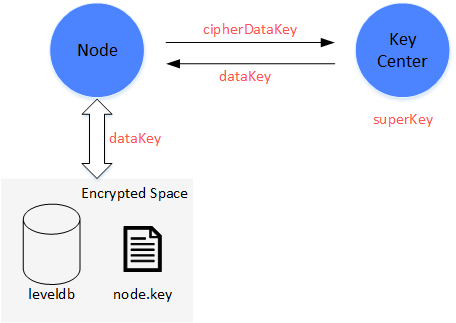

# Key Center

Manage keys for FISCO BCOS.

## Description

In FISCO BCOS consortium chain framework, each organization has their own key center. Organization use key center to manage their keys. Key center is deployed in organization's internal network.  

In **disk encryption**. This shows how key center manages data key for nodes. 



Each node has their own ``` dataKey``` and use ``` dataKey``` to communicate with its encrypted space. Node does not manage its ``` dataKey```. It only has its ``` cipherDataKey```. ``` cipherDatakey``` is the cipher of ``` datakey ```encrypted by ``` superKey```.  When node is booting, it sends ``` cipherDataKey``` to key center, and key center decrypts the ``` cipherDataKey```  using ``` superKey ``` and return ``` dataKey``` to node. Node manage ``` dataKey``` in memory and drop it after shutting down.

## How to use

### Clone

``` shell
git clone https://github.com/FISCO-BCOS/keycenter.git
```

### Build

``` shell
cd keycenter
mkdir build
cd build
cmake3 .. # Notice: There are ".." behind. 
make
#The execution: "keycenter" generated.
```

### Configure

Configure port and superkey

``` shell
vim kcconfig.ini
```

like

``` ini
[keycenter]
port=31443
superkey=01234567012345670123456701234564
```

### Start

``` shell
./keycenter kcconfig.ini
```

### Check

Print info when successfully started.

``` log
[1545471609499] [TRACE] keycenter stared. Port: 31443
```

## License


All contributions are made under the [GNU General Public License v3](https://www.gnu.org/licenses/gpl-3.0.en.html). See [LICENSE](LICENSE).
